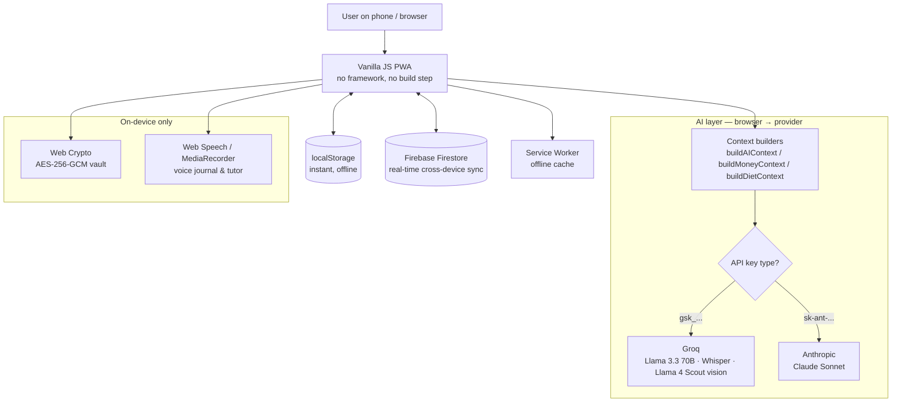

# 🧠 Vasavi Life OS

### ▶️ Live app: **https://vasaviannapureddy.github.io/vasavi-life-os/**

**An offline-first, AI-native personal operating system** — a single progressive web app (PWA) that unifies focus, health, finance, learning, language, and reflection into one data model, with a context-aware AI layer that reads your real data before it answers.

Built and shipped solo as a daily-driver on my own phone. Not a tutorial clone — every module solves a real problem I have, and the whole system runs offline-first with real-time cloud sync.

> **Stack in one line:** Vanilla JS PWA · Firebase Firestore (real-time sync) · Groq & Anthropic LLM APIs · Web Crypto · Web Speech · Service Worker

---

## Why this project matters (for reviewers)

Most "AI projects" are a notebook that calls an API once. This is a **shipped, multi-module product** where the interesting engineering is in the layer *around* the model:

- **Context engineering, not just prompting.** Every AI feature runs a dedicated builder that pulls the user's *actual* data — 3 months of categorized spending, savings goals, a 7-day food log, body metrics (BMR/TDEE), gym history, day-by-day focus minutes — and injects it into the system prompt. The model answers about *your* life, with *your* numbers, not generic advice.
- **Multimodal.** The AI Dietician reads a photo of a plate → estimates calories item by item (vision model), with client-side image preprocessing.
- **Provider abstraction.** One key box: paste a Groq key (free) and it runs Llama 3.3 70B; paste an Anthropic `sk-ant-` key and the *entire app* transparently upgrades to Claude — chat, vision, and speech all switch automatically.
- **Deterministic logic where it belongs.** Nutrition math (Mifflin–St Jeor BMR/TDEE), a spaced-repetition scheduler for vocabulary, and rule-based fallbacks so every AI feature still works with no API key.
- **Privacy engineering.** A "Vault" module encrypts entries in the browser with AES-256-GCM (PBKDF2, 150k iterations) before anything is saved — the cloud only ever stores ciphertext, and there is a no-AI "Just Listen" mode where data never leaves the device.

**Honest scope note:** the AI layer is *structured context assembly + prompt engineering*, not RAG over a vector database. Retrieval here means deterministically selecting and summarizing the user's own structured state — which is the right tool for this problem and is described accurately throughout.

---

## Architecture



### How data flows
1. **Every change writes to `localStorage` first** (instant, works fully offline) via a single `AppState` object and `saveData()`.
2. **`saveData()` then mirrors to Firebase Firestore**, giving real-time sync across devices (start on laptop, continue on phone).
3. **A Service Worker** caches the app shell so it launches with no network.
4. **AI calls are made client-side.** Each feature first assembles a structured context string from `AppState`, then sends it to the active provider. No server round-trip needed.

### Why no heavyweight backend?
The app is deliberately **client-first**: Firestore handles persistence and sync directly, so the product ships and runs without a server to maintain. (A Flask/Mongo service is scaffolded in `backend/` as a planned migration path for server-side aggregation, but the live app runs entirely on the client + Firebase.)

---

## The AI engineering, module by module

| Module | Model(s) | What's actually happening |
|---|---|---|
| **AI Assistant** | Llama 3.3 70B / Claude | `buildAIContext()` injects life-score, day-by-day weekly focus/gym/spend, DS progress, full money detail; multi-turn history is preserved per message. |
| **AI Dietician** | Llama 4 Scout (vision), Llama 3.3 70B / Claude | Text *or plate photo* → per-item calorie estimate. Image is resized on a `<canvas>` to ≤900px and base64-encoded before the multimodal call. Knows the user's usual portions and Andhra cuisine via injected profile. Deterministic BMR/TDEE math sets the daily target. |
| **Money Advisor** | Llama 3.3 70B / Claude | `buildMoneyContext()` feeds 3 months of income vs. expense-by-category, savings goals, and net saved so "can I afford X?" is answered from real numbers. |
| **Language Tutor** | Whisper (STT) + LLM + Web Speech (TTS) | Full speech-to-speech loop: mic → transcription → tutored reply → spoken back. ChatGPT-style per-day chat history. |
| **60-Second Teacher** | Whisper + LLM | Records a 60s spoken explanation, transcribes it, and grades clarity + suggests sharper vocabulary with a score — Feynman technique as a feature. |
| **Vocabulary Review** | none (algorithm) | Spaced-repetition scheduler (1 → 3 → 7 → 30 → 90 day intervals) for durable recall. |
| **Vault** | none (Web Crypto) | Client-side AES-256-GCM encryption; passphrase is never stored; optional fully-offline "Just Listen" mode. |

---

## Feature map

**Focus & Productivity** — focus timer with Pomodoro/Deep-Work, daily planner, goals, dashboard life-score, cross-module analytics with calendar heatmaps and AI monthly summaries.

**Health** — habits tracker (dated history, forgiving streaks), editable gym planner with per-day workouts, AI Dietician (photo/text calorie logging, steps, BMR/TDEE), Brain Gym (word-retrieval training, fluency sprints, daily AI concept bytes).

**Finance** — expenses with custom categories, income tracking, savings goals, savings-rate math, month/year analytics, and a money-aware AI advisor.

**Learning & Language** — Learning OS with a curated mind-map plus an AI "Discover" mode (surprise lessons that learn your taste + a curiosity inbox), English/Korean tutor with voice, spaced-repetition vocabulary.

**Reflection** — rich notes (Word-style editor), voice journal, Life Memories (monthly auto-generated PDF "chapters" of your life), and the encrypted Vault.

**Automation** — configurable reminder engine that can nudge via browser notification, WhatsApp (CallMeBot), or email (EmailJS) when daily targets slip.

---

## Data model (the "database")

State is a single JSON `AppState` object, persisted to `localStorage` and mirrored to a per-user Firestore document. Representative shape:

```js
AppState = {
  sessions:  [{ start, end, duration, what }],      // focus timer
  habits:    [{ name, cat, history: { 'YYYY-MM-DD': 1 } }],
  expenses:  [{ amount, cat, date, note }],
  income:    [{ amount, source, date }],
  savingsGoals: [{ name, target, saved }],
  dietProfile:  { heightCm, weightKg, age, activity, goal, portions },
  dietLog:   { 'YYYY-MM-DD': { meals: [{ desc, kcal }], steps } },
  langVocab: { en: [{ word, meaning, example, srs: { level, next } }] },
  memories:  [{ tag, title, text, date }],
  vault:     { salt, verifier, entries: [/* AES-GCM ciphertext only */] },
  // …focus, goals, learning, jobs, journal, reflections, etc.
}
```

Analytics are computed on the fly by a shared engine (`utils/analytics_engine.js`) that aggregates these into daily/weekly/monthly/yearly views, streaks, and heatmaps.

---

## Tech stack

- **Frontend:** Vanilla JavaScript (no framework, no build step), modular `render*()` functions, CSS custom properties
- **Persistence & sync:** `localStorage` (offline-first) + **Firebase Firestore** (real-time cross-device sync)
- **AI:** Groq API (Llama 3.3 70B, Whisper, Llama 4 Scout vision) with transparent **Anthropic Claude** fallback via key detection
- **On-device:** Web Crypto (AES-256-GCM), Web Speech API + MediaRecorder, Canvas image preprocessing
- **PWA:** Web App Manifest + Service Worker (installable, offline)
- **Automation:** CallMeBot (WhatsApp), EmailJS (email), Google Calendar
- **Hosting:** static deploy (GitHub Pages) — Firebase handles all persistence and sync directly from the client

---

## What this project demonstrates

- Shipping a **large, real, multi-feature product end to end** — 25+ modules, offline-first, running daily on a real device
- **Applied AI beyond a single API call:** context engineering, multimodal vision, a speech-to-speech pipeline, provider abstraction, and knowing when to use deterministic logic instead of a model
- **Client-side systems thinking:** offline-first state, real-time sync, service workers, and browser-native cryptography
- Product sense: designing features around real behavior (forgiving streaks, portion-aware calorie estimates, privacy-first journaling)

---

## Running locally

```bash
# Any static server works — it's a client-side PWA
python -m http.server 4173
# then open http://localhost:4173
```

Add a Groq API key (free) or an Anthropic `sk-ant-` key inside the app's **AI Assistant** page to enable the AI features. Without a key, every AI feature falls back to built-in rule-based responses.

---

_Built by Vasavi Annapureddy — a personal operating system, shipped and used daily._
